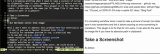

## Introduction
It's a breaking workflow when I need to take a picture of screen (to clipboard), save it into somewhere and link it before starting to write something in markdown. This plugin is to fix that for vim users. It can also do the same job for image file if you have its absolute path in clipboard!

## Screenshot

## Before PlugInstall
- Python working for neovim
- For Mac OSX user, simply `brew install pygobject3 --with-python3 gtk+3` (both python2 and python3)
- For Linux user, simply install `pygobject` e.g. `yum install pygobject2` (python2)
- For Windows user, good luck and follow [this](http://pygobject.readthedocs.io/en/latest/getting_started.html#windows-logo-windows) instruction

## Install
```
Plug 'daizeng1984/vim-snip-and-paste'
```
As all Python remote plugins, after you `PlugInstall`, you need to run `:UpdateRemotePlugins`.

## TODO
- [ ] Fix bug that when filename is empty
- [ ] Gifs
- [ ] Allow moving or renaming folder
- [ ] More configurables
- [ ] *Add runtime colorful markdown image preview in vim with PIL
